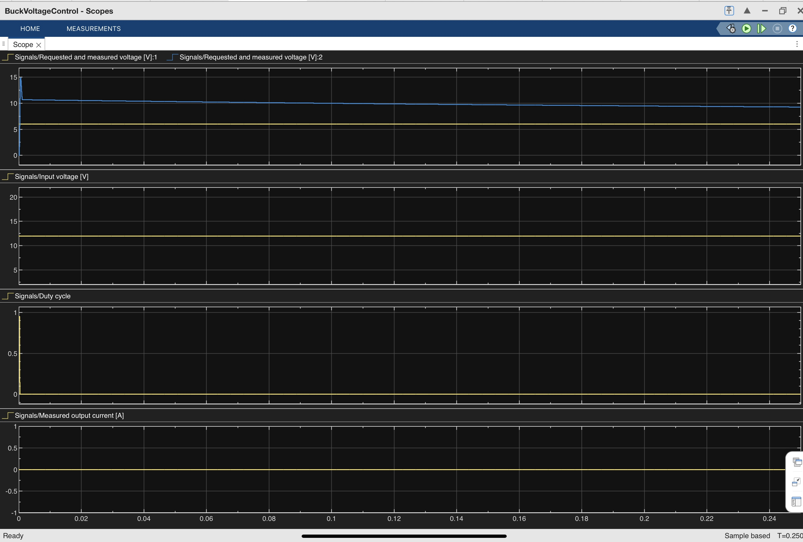

# Study and Simulation of a DC–DC Buck Converter using MATLAB/Simulink
## Inspiration
 After a long academic gap,I slowly and steadily wanted to rebuild my foundation in power electronics.Hence I was motivated with study and basic simulation of DC-DC converter matlab/simulink project which included voltage regulation,switching behaviour and graphical observation of system level operation.DC-DC buck converters are basic blocks in electric vehicle systems used for small output power applications
## Project 
This system is modelLed based on standard close loop dc-dc converter circuit used in electric vehicle.Basically DC-DC buck converter circuit is used to step down the voltage generated by battery source in an electric vehicle which is usually around 300v -600v.This high voltage is needed for main operation such as running the vehicle.There are certain operations which require very small voltage levels around 10v to 30v such as headlight source or window motor operations.In such cases the dc-dc converter steps down high voltage such as 300v to 600 v to low voltage range such as 10v to 30v depending on the load requirement.While such converters are widely used in EV Auxillary system,this work does not model complete EV charging and discharging system.
## A simple dc-dc converter circuits consists of  
1.DC voltage source-Vin=this provides fixed dc voltage as input to the converter.
2.Switch=to regulate the flow of current depending upon the duty cycle.
3.Inductor=to store energy in its magnetic field during switch on period and releases it  during switch off period thus maintains the flow of current.
4.Capacitor=to filter the output of any ripple effect.
5.Diode= to provide path for inductor current during switch off state thus maintaining continuous flow of current.
## Simulation Setup and Observations
The buck converter was simulated using MATLAB/Simulink with Simscape Electrical blocks. Time-domain simulations were performed to study steady-state and transient behavior.
The input DC voltage (Vin) was initially set to 12 V and later increased to 18 V to observe line regulation.
A step change in load resistance was applied to evaluate the response of the system.
 Scope blocks were used to monitor output voltage, input voltage, duty cycle, and output current.
## Key Observations
The output voltage closely tracked the reference voltage despite changes in input voltage, demonstrating effective closed-loop regulation.
During load step changes, a transient deviation was observed in the output voltage, followed by rapid recovery, indicating stable behavior.
The duty cycle adjusted automatically in response to both line and load variations.
Output current changed proportionally with load resistance, confirming correct power-stage operation.
## Simulation Results
Baseline Operation (Vin = 12 V)
The following figure shows the baseline response of the buck converter under nominal input voltage conditions. The output voltage is regulated to the reference value, while the duty cycle and output current reflect steady-state operation.

## Input Voltage Variation (Vin = 18 V)
This figure illustrates the system response when the input voltage is increased from 12 V to 18 V. The output voltage remains regulated due to closed-loop control, while the duty cycle adjusts automatically to compensate for the change in input conditions.

